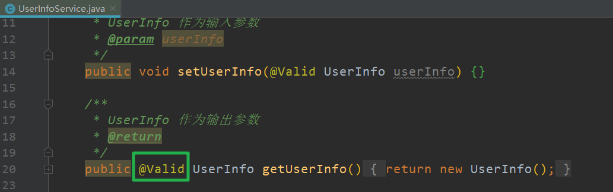
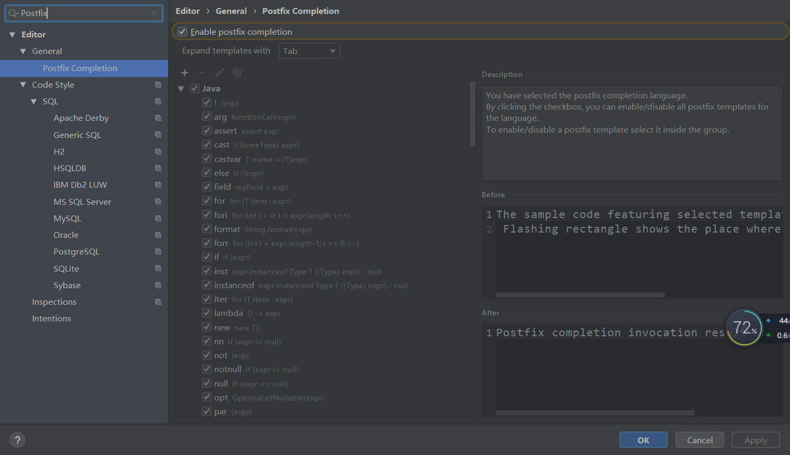
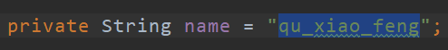

高效编程

# 第2章 函数编程

##  2-2 实战：购物车案例

### 1.下单商品信息对象

```java
package com.imooc.zhangxiaoxi.lambda.cart;

/**
 * 下单商品信息对象
 */
public class Sku {
    // 编号
    private Integer skuId;
    // 商品名称
    private String skuName;
    // 单价
    private Double skuPrice;
    // 购买个数
    private Integer totalNum;
    // 总价
    private Double totalPrice;
    // 商品类型
    private Enum skuCategory;

    /**
     * 构造函数
     * @param skuId
     * @param skuName
     * @param skuPrice
     * @param totalNum
     * @param totalPrice
     * @param skuCategory
     */
    public Sku(Integer skuId, String skuName,
               Double skuPrice, Integer totalNum,
               Double totalPrice, Enum skuCategory) {
        this.skuId = skuId;
        this.skuName = skuName;
        this.skuPrice = skuPrice;
        this.totalNum = totalNum;
        this.totalPrice = totalPrice;
        this.skuCategory = skuCategory;
    }

    /**
     * Get方法
     * @return
     */
    public Integer getSkuId() {
        return skuId;
    }

    public String getSkuName() {
        return skuName;
    }

    public Double getSkuPrice() {
        return skuPrice;
    }

    public Integer getTotalNum() {
        return totalNum;
    }

    public Double getTotalPrice() {
        return totalPrice;
    }

    public Enum getSkuCategory() {
        return skuCategory;
    }
}

```

### 2.商品类型枚举

```java
package com.imooc.zhangxiaoxi.lambda.cart;

/**
 * 商品类型枚举
 */
public enum SkuCategoryEnum {
    CLOTHING(10, "服装类"),
    ELECTRONICS(20, "数码类"),
    SPORTS(30, "运动类"),
    BOOKS(40, "图书类");

    // 商品类型的编号
    private Integer code;
    // 商品类型的名称
    private String name;

    /**
     * 构造函数
     * @param code
     * @param name
     */
    SkuCategoryEnum(Integer code, String name) {
        this.code = code;
        this.name = name;
    }
}

```

### 3.购物车服务类

```java
package com.imooc.zhangxiaoxi.lambda.cart;

import java.util.ArrayList;
import java.util.List;

/**
 * 购物车服务类
 */
public class CartService {

    // 加入到购物车中的商品信息
    private static List<Sku> cartSkuList =
            new ArrayList<Sku>(){
        {
            add(new Sku(654032, "无人机",
                    4999.00, 1,
                    4999.00, SkuCategoryEnum.ELECTRONICS));

            add(new Sku(642934, "VR一体机",
                    2299.00, 1,
                    2299.00, SkuCategoryEnum.ELECTRONICS));

            add(new Sku(645321, "纯色衬衫",
                    409.00, 3,
                    1227.00, SkuCategoryEnum.CLOTHING));

            add(new Sku(654327, "牛仔裤",
                    528.00, 1,
                    528.00, SkuCategoryEnum.CLOTHING));

            add(new Sku(675489, "跑步机",
                    2699.00, 1,
                    2699.00, SkuCategoryEnum.SPORTS));

            add(new Sku(644564, "Java编程思想",
                    79.80, 1,
                    79.80, SkuCategoryEnum.BOOKS));

            add(new Sku(678678, "Java核心技术",
                    149.00, 1,
                    149.00, SkuCategoryEnum.BOOKS));

            add(new Sku(697894, "算法",
                    78.20, 1,
                    78.20, SkuCategoryEnum.BOOKS));

            add(new Sku(696968, "TensorFlow进阶指南",
                    85.10, 1,
                    85.10, SkuCategoryEnum.BOOKS));
        }
    };

    /**
     * 获取商品信息列表
     * @return
     */
    public static List<Sku> getCartSkuList() {
        return cartSkuList;
    }

    
}

```

---

##  2-3 实战：硬编码业务逻辑

找出商品中的电子产品

```java
/**
     * Version 1.0.0
     * 找出购物车中所有电子产品
     * @param cartSkuList
     * @return
     */
    public static List<Sku> filterElectronicsSkus(
            List<Sku> cartSkuList) {

        List<Sku> result = new ArrayList<Sku>();
        for (Sku sku: cartSkuList) {
            // 如果商品类型 等于 电子类
            if (SkuCategoryEnum.ELECTRONICS.
                    equals(sku.getSkuCategory())) {
                result.add(sku);
            }
        }
        return result;
    }
```

添加一个依赖，用来解析打印的信息

```xml
<dependency>
      <groupId>com.alibaba</groupId>
      <artifactId>fastjson</artifactId>
      <version>1.2.58</version>
    </dependency>
```

测试

```java
package com.imooc.zhangxiaoxi.lambda.cart;

import com.alibaba.fastjson.JSON;
import org.junit.Test;

import java.util.List;

public class Version1Test {

    @Test
    public void filterElectronicsSkus() {
        List<Sku> cartSkuList = CartService.getCartSkuList();

        // 查找购物车中数码类商品
        List<Sku> result =
                CartService.filterElectronicsSkus(cartSkuList);

        System.out.println(
                // true 按照json的格式输出
                // false 单行输出
                JSON.toJSONString(result, true));
    }

}

```

## 2-4 实战：单一维度条件参数化

查看每一类的产品都有哪些

```java
/**
     * Version 2.0.0
     * 根据传入商品类型参数，找出购物车中同种商品类型的商品列表
     * @param cartSkuList
     * @param category
     * @return
     */
    public static List<Sku> filterSkusByCategory(
            List<Sku> cartSkuList, SkuCategoryEnum category) {

        List<Sku> result = new ArrayList<Sku>();
        for (Sku sku: cartSkuList) {
            // 如果商品类型 等于 传入商品类型参数
            if (category.equals(sku.getSkuCategory())) {
                result.add(sku);
            }
        }
        return result;
    }
```

测试

```java
package com.imooc.zhangxiaoxi.lambda.cart;

import com.alibaba.fastjson.JSON;
import org.junit.Test;

import java.util.List;

public class Version2Test {

    @Test
    public void filterSkusByCategory() {
        List<Sku> cartSkuList = CartService.getCartSkuList();

        // 查找购物车中图书类商品集合
        List<Sku> result = CartService.filterSkusByCategory(
                cartSkuList, SkuCategoryEnum.BOOKS);

        System.out.println(JSON.toJSONString(
                result, true));
    }

}

```

## 2-5 实战：多维度条件参数化

支持通过商品类型或总价来过滤商品

```java
/**
     * Version 3.0.0
     * 支持通过商品类型或总价来过滤商品
     * @param cartSkuList
     * @param category
     * @param totalPrice
     * @param categoryOrPrice - true: 根据商品类型，false: 根据商品总价
     * @return
     */
    public static List<Sku> filterSkus(
            List<Sku> cartSkuList, SkuCategoryEnum category,
            Double totalPrice, Boolean categoryOrPrice) {

        List<Sku> result = new ArrayList<Sku>();
        for (Sku sku: cartSkuList) {

            // 如果根据商品类型判断，sku类型与输入类型比较
            // 如果根据商品总价判断，sku总价与输入总价比较
            if (
                    (categoryOrPrice
                            && category.equals(sku.getSkuCategory())
                    ||
                    (!categoryOrPrice
                            && sku.getTotalPrice() > totalPrice))) {
                result.add(sku);
            }
        }
        return result;
    }
```

测试

```java
package com.imooc.zhangxiaoxi.lambda.cart;

import com.alibaba.fastjson.JSON;
import org.junit.Test;

import java.util.List;

public class Version3Test {

    @Test
    public void filterSkus() {
        List<Sku> cartSkuList = CartService.getCartSkuList();

        // 根据商品总价过滤超过2000元的商品列表
        List<Sku> result = CartService.filterSkus(
                cartSkuList, null,
                2000.00, false);

        System.out.println(JSON.toJSONString(
                result, true));
    }

}

```

---

##  2-6 实战：判断逻辑参数化

### 1.实体类

根据不同的Sku判断标准，对Sku列表进行过滤

>  Sku选择谓词接口

```java
package com.imooc.zhangxiaoxi.lambda.cart;

/**
 * Sku选择谓词接口
 */
public interface SkuPredicate {

    /**
     * 选择判断标准
     * @param sku
     * @return
     */
    boolean test(Sku sku);

}

```

> 对Sku的商品类型为图书类的判断标准

```java
package com.imooc.zhangxiaoxi.lambda.cart;

/**
 * 对Sku的商品类型为图书类的判断标准
 */
public class SkuBooksCategoryPredicate implements SkuPredicate {
    @Override
    public boolean test(Sku sku) {
        return SkuCategoryEnum.BOOKS.equals(sku.getSkuCategory());
    }
}

```

> 对Sku的总价是否超出2000作为判断标准

```java
package com.imooc.zhangxiaoxi.lambda.cart;

/**
 * 对Sku的总价是否超出2000作为判断标准
 */
public class SkuTotalPricePredicate implements SkuPredicate {
    @Override
    public boolean test(Sku sku) {
        return sku.getTotalPrice() > 2000;
    }
}

```

> 根据不同的Sku判断标准，对Sku列表进行过滤

```java
/**
     * Version 4.0.0
     * 根据不同的Sku判断标准，对Sku列表进行过滤
     * @param cartSkuList
     * @param predicate - 不同的Sku判断标准策略
     * @return
     */
    public static List<Sku> filterSkus(
            List<Sku> cartSkuList, SkuPredicate predicate) {

        List<Sku> result = new ArrayList<Sku>();
        for (Sku sku: cartSkuList) {
            // 根据不同的Sku判断标准策略，对Sku进行判断
            if (predicate.test(sku)) {
                result.add(sku);
            }
        }
        return result;
    }
```

测试

```java
package com.imooc.zhangxiaoxi.lambda.cart;

import com.alibaba.fastjson.JSON;
import org.junit.Test;

import java.util.List;

public class Version4Test {

    @Test
    public void filterSkus() {
        List<Sku> cartSkuList = CartService.getCartSkuList();

        // 过滤商品总价大于2000的商品
        List<Sku> result = CartService.filterSkus(
                cartSkuList, new SkuTotalPricePredicate());

        System.out.println(JSON.toJSONString(
                result, true));
    }

}

```

---

###  2.匿名类

因为类只使用一次，没有必要创建实体类，我们可以在这里使用匿名类

```java
package com.imooc.zhangxiaoxi.lambda.cart;

import com.alibaba.fastjson.JSON;
import org.junit.Test;

import java.util.List;

public class Version5Test {

    @Test
    public void filterSkus() {
        List<Sku> cartSkuList = CartService.getCartSkuList();

        // 过滤商品单价大于1000的商品
        List<Sku> result = CartService.filterSkus(
                cartSkuList, new SkuPredicate() {
                    @Override
                    public boolean test(Sku sku) {
                        return sku.getSkuPrice() > 1000;
                    }
                });

        System.out.println(JSON.toJSONString(
                result, true));
    }

}

```

---

### 3.Lambda表达式

```java
package com.imooc.zhangxiaoxi.lambda.cart;

import com.alibaba.fastjson.JSON;
import org.junit.Test;

import java.util.List;

public class Version6Test {

    @Test
    public void filterSkus() {
        List<Sku> cartSkuList = CartService.getCartSkuList();

        // 过滤商品单价大于1000的商品
        List<Sku> result = CartService.filterSkus(
                cartSkuList,
                (Sku sku) -> sku.getSkuPrice() > 1000);

        System.out.println(JSON.toJSONString(
                result, true));
    }

}

```

```
函数编程演化历程
1.将业务逻辑直接写死在代码里。
2.将单一维度的条件做为参数传入方法中方法内根据参数进行业务逻辑实现。
3.将多个维度的条件做为参数传入方法中。业务实现需要根据不同的参数处理不同逻辑。
4.将业务逻辑封装为一个实体类,方法接受实体类为参数,方法内部调用实体类的处理逻辑。
5.调用方法时不在创建实体类,而是使用匿名函数的形式替代。
6.使用 Lambda表达式替代匿名函数的形,做为方法的参数。真正实现判断逻辑参数化传递。
```

---

## 2-9 Lambda表达式

### 1.Lambda表达式简介

```
◆Java8引入函数式编程风格
◆可以理解为一种匿名函数的代替
◆通过行为参数化传递代码
```

### 2.4Lambda表达式形式

```
（parameters） -> expression
（parameters） -> { statement; }
```

```
形式一:没有参数
 ()-> System.out.println(" Hello World ! );
```

```
形式二:只有一个参数
 name-> System.out.println(
 	"Hello World from"+name+"!")
```

```
形式三:没有参数,逻辑复杂
()->{
 	System.out.println(" Hello");
 	System.out.println("World");
 	}
```

```
形式四:包含两个参数的方法
 BinaryOperator<Long> functionAdd =(x, y)-> x + y;
 Long result = functionAdd.apply(1L, 2L);
```

```
形式五:对参数显示声明
 BinaryOperator<Long> functionAdd = (Long x, Long y)-> x+y;
 Long result = functionAdd.apply(1L, 2L);
```


---

## 2-10 函数式接口

### 1.要求

```
◆接口中只有一个抽象方法
◆Java8的函数式接口注解：@FunctionInterface
◆函数式接口的抽象方法签名：函数描述符
```

### 2.实战案例:自定义函数式接口

自定义函数式接口,实现读取本地文件，后自定义处理逻辑功能。

```java
package com.imooc.zhangxiaoxi.lambda.file;

/**
 * 文件处理函数式接口
 */
@FunctionalInterface
public interface FileConsumer {

    /**
     * 函数式接口抽象方法
     * @param fileContent - 文件内容字符串
     */
    void fileHandler(String fileContent);

}

```

```java
package com.imooc.zhangxiaoxi.lambda.file;

import java.io.BufferedReader;
import java.io.FileInputStream;
import java.io.IOException;
import java.io.InputStreamReader;

/**
 * 文件服务类
 */
public class FileService {

    /**
     * 从过url获取本地文件内容，调用函数式接口处理
     * @param url
     * @param fileConsumer
     */
    public void fileHandle(String url, FileConsumer fileConsumer)
            throws IOException {

        // 创建文件读取流
        BufferedReader bufferedReader = new BufferedReader(
                new InputStreamReader(
                        new FileInputStream(url)));

        // 定义行变量和内容sb
        String line;
        StringBuilder stringBuilder = new StringBuilder();

        // 循环读取文件内容
        while ((line = bufferedReader.readLine()) != null) {
            stringBuilder.append(line + "\n");
        }

        // 调用函数式接口方法，将文件内容传递给lambda表达式，实现业务逻辑
        fileConsumer.fileHandler(stringBuilder.toString());
    }

}

```

测试

1.

```java
package com.imooc.zhangxiaoxi.lambda.file;

import org.junit.Test;

import java.io.IOException;

public class FileServiceTest {

    @Test
    public void fileHandle() throws IOException {
        FileService fileService = new FileService();

        // TODO 此处替换为本地文件的地址全路径
        String filePath = "E:\\infos.txt";

        // 通过lambda表达式，打印文件内容
        fileService.fileHandle(filePath,
                fileContent -> {
                    System.out.println(fileContent);
                });
    }
}

```

2.

```java
package com.imooc.zhangxiaoxi.lambda.file;

import org.junit.Test;

import java.io.IOException;

public class FileServiceTest {

    @Test
    public void fileHandle() throws IOException {
        FileService fileService = new FileService();

        // TODO 此处替换为本地文件的地址全路径
        String filePath = "E:\\infos.txt";

        // 通过lambda表达式，打印文件内容
        fileService.fileHandle(filePath,
                fileContent -> System.out.println(fileContent));
    }
}

```

3.

```java
package com.imooc.zhangxiaoxi.lambda.file;

import org.junit.Test;

import java.io.IOException;

public class FileServiceTest {

    @Test
    public void fileHandle() throws IOException {
        FileService fileService = new FileService();

        // TODO 此处替换为本地文件的地址全路径
        String filePath = "E:\\infos.txt";

        // 通过lambda表达式，打印文件内容
        fileService.fileHandle(filePath,

                System.out::println);
    }
}

```

----

## 2-11 常用函数接口及使用


## 2-12 方法引用


```
方法引用
调用特定方法的 Lambda表达式的一种快捷写法,可以让你重复使用现有的方法定义,并像 Lambda表达式一样传递他们。
```


---

# 第3章 流编程

## 3-1 流式编程开场与案例场景概述

实战案例:集合与流操作对比

```
◆实战:分别使用集合操作及 Stream流操作,完成对实际应用场景中的数据处理。直观感受流操作带来的便捷性。
```

## 3-2 实战：传统方式处理业务逻辑

```java
package com.imooc.zhangxiaoxi.stream;

import com.alibaba.fastjson.JSON;
import com.imooc.zhangxiaoxi.lambda.cart.CartService;
import com.imooc.zhangxiaoxi.lambda.cart.Sku;
import com.imooc.zhangxiaoxi.lambda.cart.SkuCategoryEnum;
import org.junit.Test;

import java.util.ArrayList;
import java.util.Comparator;
import java.util.List;
import java.util.concurrent.atomic.AtomicReference;
import java.util.stream.Collectors;

/**
 * 对比：原始集合操作与Stream集合操作
 */
public class StreamVs {

    /**
     * 1 想看看购物车中都有什么商品
     * 2 图书类商品都给买
     * 3 其余的商品中买两件最贵的
     * 4 只需要两件商品的名称和总价
     */

    /**
     * 以原始集合操作实现需求
     */
    @Test
    public void oldCartHandle() {
        List<Sku> cartSkuList = CartService.getCartSkuList();

        /**
         * 1 打印所有商品
         */
        for (Sku sku: cartSkuList) {
            System.out.println(JSON.toJSONString(sku, true));
        }

        /**
         * 2 图书类过滤掉
         */
        List<Sku> notBooksSkuList = new ArrayList<Sku>();
        for (Sku sku: cartSkuList) {
            if (!SkuCategoryEnum.BOOKS.equals(sku.getSkuCategory())) {
                notBooksSkuList.add(sku);
            }
        }

        /**
         * 排序
         */
        notBooksSkuList.sort(new Comparator<Sku>() {
            @Override
            public int compare(Sku sku1, Sku sku2) {
                if (sku1.getTotalPrice() > sku2.getTotalPrice()) {
                    return -1;
                } else if (sku1.getTotalPrice() < sku2.getTotalPrice()) {
                    return 1;
                } else {
                    return 0;
                }
            }
        });

        /**
         * TOP2
         */
        List<Sku> top2SkuList = new ArrayList<Sku>();
        for (int i = 0; i < 2; i++) {
            top2SkuList.add(notBooksSkuList.get(i));
        }

        /**
         * 4 求两件商品的总价
         */
        Double money = 0.0;
        for (Sku sku: top2SkuList) {
            // money = money + sku.getTotalPrice();
            money += sku.getTotalPrice();
        }

        /**
         * 获取两件商品的名称
         */
        List<String> resultSkuNameList = new ArrayList<String>();
        for (Sku sku: top2SkuList) {
            resultSkuNameList.add(sku.getSkuName());
        }

        /**
         * 打印输入结果
         */
        System.out.println(
                JSON.toJSONString(resultSkuNameList, true));
        System.out.println("商品总价：" + money);

    }
}

```

## 3-3 实战：利用Lambda+Stream处理业务逻辑

```java
/**
     * 以Stream流方式实现需求
     */
    @Test
    public void newCartHandle() {
        // 原子引用类，为了多线程安全
        AtomicReference<Double> money =
                new AtomicReference<>(Double.valueOf(0.0));

        List<String> resultSkuNameList =
                CartService.getCartSkuList()
                .stream()
                /**
                 * 1 打印商品信息
                 */
                .peek(sku -> System.out.println(
                        JSON.toJSONString(sku, true)))
                /**
                 * 2 过滤掉所有图书类商品
                 */
                .filter(sku -> !SkuCategoryEnum.BOOKS.equals(
                        sku.getSkuCategory()))
                /**
                 * 排序
                 * 从大到小
                 */
                .sorted(Comparator.
                        comparing(Sku::getTotalPrice).reversed())
                /**
                 * TOP2
                 */
                .limit(2)

                /**
                 * 累加商品总金额
                 */
                .peek(sku -> money.set(money.get() + sku.getTotalPrice()))

                /**
                 * 获取商品名称
                 */
                .map(sku -> sku.getSkuName())

                /**
                 * 收集结果
                 */
                .collect(Collectors.toList());


        /**
         * 打印输入结果
         */
        System.out.println(
                JSON.toJSONString(resultSkuNameList, true));
        System.out.println("商品总价：" + money.get());
    }

```

---

## 3-5 流的初体验

### 流是什么?

```
◆JDK1.8引入的新成员,以声明式方式处理集合数据
◆将基础操作链接起来,完成复杂的数据处理流水线
◆提供透明的并行处理
```

### 流的组成


## 3-6 流操作分类


流的使用


---

##  3-7 实战：常用中间操作演示

### 1.过滤/映射/扁平化

演示流的各种操作

```java
package com.imooc.zhangxiaoxi.stream;

import com.alibaba.fastjson.JSON;
import com.imooc.zhangxiaoxi.lambda.cart.CartService;
import com.imooc.zhangxiaoxi.lambda.cart.Sku;
import com.imooc.zhangxiaoxi.lambda.cart.SkuCategoryEnum;
import org.junit.Before;
import org.junit.Test;

import java.util.*;

/**
 * 演示流的各种操作
 */
public class StreamOperator {

    List<Sku> list;

    @Before
    public void init() {
        list = CartService.getCartSkuList();
    }
}
```

filter使用：过滤掉不符合断言判断的数据

```java
 /**
     * filter使用：过滤掉不符合断言判断的数据
     */
    @Test
    public void filterTest() {
        //创建流
        list.stream()

                // filter
                .filter( sku ->
                        SkuCategoryEnum.BOOKS
                                .equals(sku.getSkuCategory()))

                .forEach(item ->
                        System.out.println(
                                JSON.toJSONString(
                                        item, true)));
    }
```

---

map使用：将一个元素转换成另一个元素

```java
/**
     * map使用：将一个元素转换成另一个元素
     */
    @Test
    public void mapTest() {
        list.stream()

                // map
                .map(sku -> sku.getSkuName())

                .forEach(item ->
                        System.out.println(
                                JSON.toJSONString(
                                        item, true)));
    }
```

flatMap使用：将一个对象转换成流

```java
/**
     * flatMap使用：将一个对象转换成流
     */
    @Test
    public void flatMapTest() {
        list.stream()

                // flatMap
                // 接受一个元素，返回一个新的流
                .flatMap(sku -> Arrays.stream(
                        sku.getSkuName().split("")))

                .forEach(item ->
                        System.out.println(
                                JSON.toJSONString(
                                        item, true)));
    }
```

---

### 2.遍历/排序

peek使用：对流中元素进行遍历操作，与forEach类似，但不会销毁流元素

```java
/**
     * peek使用：对流中元素进行遍历操作，与forEach类似，但不会销毁流元素
     */
    @Test
    public void peek() {
        list.stream()

                // peek
                .peek(sku -> System.out.println(sku.getSkuName()))

                .forEach(item ->
                        System.out.println(
                                JSON.toJSONString(
                                        item, true)));
    }
```

sort使用：对流中元素进行排序，可选则自然排序或指定排序规则。有状态操作

```java
/**
     * sort使用：对流中元素进行排序，可选则自然排序或指定排序规则。有状态操作
     */
    @Test
    public void sortTest() {
        list.stream()

                .peek(sku -> System.out.println(sku.getSkuName()))

                //sort
                .sorted(Comparator.comparing(Sku::getTotalPrice))

                .forEach(item ->
                        System.out.println(
                                JSON.toJSONString(
                                        item, true)));
    }
```

---

### 3.去重/跳过/截断

distinct使用：对流元素进行去重。有状态操作

```JAVA
/**
     * distinct使用：对流元素进行去重。有状态操作
     */
    @Test
    public void distinctTest() {
        list.stream()
                .map(sku -> sku.getSkuCategory())

                // distinct
                .distinct()

                .forEach(item ->
                        System.out.println(
                                JSON.toJSONString(
                                        item, true)));


    }
```

skip使用：跳过前N条记录。有状态操作

```java
/**
     * skip使用：跳过前N条记录。有状态操作
     */
    @Test
    public void skipTest() {
        list.stream()

                .sorted(Comparator.comparing(Sku::getTotalPrice))

                // skip
                // 过滤掉前3条数据
                .skip(3)

                .forEach(item ->
                        System.out.println(
                                JSON.toJSONString(
                                        item, true)));
    }
```

limit使用：截断前N条记录。有状态操作

```java
/**
     * limit使用：截断前N条记录。有状态操作
     */
    @Test
    public void limitTest() {
        list.stream()
                .sorted(Comparator.comparing(Sku::getTotalPrice))

                // 模拟分页操作
                .skip(2 * 3)

                // limit
                // 选取前3条数据
                .limit(3)

                .forEach(item ->
                        System.out.println(
                                JSON.toJSONString(
                                        item, true)));
    }
```

---

## 3-11 实战：常用终端操作演示

### 1.匹配

```java
/**
     * allMatch使用：终端操作，短路操作。所有元素匹配，返回true
     */
    @Test
    public void allMatchTest() {
        boolean match = list.stream()

                .peek(sku -> System.out.println(sku.getSkuName()))

                // allMatch
                // 全部满足条件，返回true
                .allMatch(sku -> sku.getTotalPrice() > 100);

        System.out.println(match);
    }

    /**
     * anyMatch使用：任何元素匹配，返回true
     */
    @Test
    public void anyMatchTest() {
        boolean match = list.stream()

                .peek(sku -> System.out.println(sku.getSkuName()))

                // anyMatch
                // 只要一个满足条件，满足true
                .anyMatch(sku -> sku.getTotalPrice() > 100);

        System.out.println(match);
    }

    /**
     * noneMatch使用：任何元素都不匹配，返回true
     */
    @Test
    public void noneMatchTest() {
        boolean match = list.stream()

                .peek(sku -> System.out.println(sku.getSkuName()))

                // noneMatch
                .noneMatch(sku -> sku.getTotalPrice() > 10_000);

        System.out.println(match);
    }

```

### 2.查找

```java
/**
     * 找到第一个
     */
    @Test
    public void findFirstTest() {
        Optional<Sku> optional = list.stream()

                .peek(sku -> System.out.println(sku.getSkuName()))

                // findFirst
                .findFirst();

        System.out.println(
                JSON.toJSONString(optional.get(), true));
    }

    /**
     * 找任意一个
     */
    @Test
    public void findAnyTest() {
        Optional<Sku> optional = list.stream()

                .peek(sku -> System.out.println(sku.getSkuName()))

                // findAny
                .findAny();

        System.out.println(
                JSON.toJSONString(optional.get(), true));
    }
```

### 3.最大/最小/计数

```java
/**
     * max使用：
     */
    @Test
    public void maxTest() {
        OptionalDouble optionalDouble = list.stream()
                // 获取总价
                .mapToDouble(Sku::getTotalPrice)

                .max();

        System.out.println(optionalDouble.getAsDouble());
    }

    /**
     * min使用
     */
    @Test
    public void minTest() {
        OptionalDouble optionalDouble = list.stream()
                // 获取总价
                .mapToDouble(Sku::getTotalPrice)

                .min();

        System.out.println(optionalDouble.getAsDouble());
    }

    /**
     * count使用
     */
    @Test
    public void countTest() {
        long count = list.stream()
                .count();

        System.out.println(count);
    }
```

---

## 3-15 实战：流的构建四种形式

```
◆由值创建流
◆由数组创建流
◆由文件生成流
◆由函数生成流(无限流)
```

```java
package com.imooc.zhangxiaoxi.stream;

import org.junit.Test;

import java.io.IOException;
import java.nio.file.Files;
import java.nio.file.Paths;
import java.util.Arrays;
import java.util.stream.IntStream;
import java.util.stream.Stream;

/**
 * 流的四种构建形式
 */
public class StreamConstructor {

    /**
     * 由数值直接构建流
     */
    @Test
    public void streamFromValue() {
        Stream stream = Stream.of(1, 2, 3, 4, 5);

        stream.forEach(System.out::println);
    }

    /**
     * 通过数组构建流
     */
    @Test
    public void streamFromArray() {
        int[] numbers = {1, 2, 3, 4, 5};

        IntStream stream = Arrays.stream(numbers);
        stream.forEach(System.out::println);
    }

    /**
     * 通过文件生成流
     * @throws IOException
     */
    @Test
    public void streamFromFile() throws IOException {
        // TODO 此处替换为本地文件的地址全路径
        String filePath = "D:\\BaiduNetdiskDownload\\7、高效996\\新资料\\资料\\最新" +
                "\\996\\src\\test\\java\\com\\" +
                "imooc\\zhangxiaoxi\\stream\\StreamConstructor.java";

        Stream<String> stream = Files.lines(
                Paths.get(filePath));

        stream.forEach(System.out::println);
    }

    /**
     * 通过函数生成流（无限流）
     */
    @Test
    public void streamFromFunction() {

//        Stream stream = Stream.iterate(0, n -> n + 2);

        Stream stream = Stream.generate(Math::random);

        stream.limit(100)
                .forEach(System.out::println);

    }

}

```

---

## 3-16 收集器与预定义收集器概述

收集器简介

```
◆将流中的元素累积成一个结果
◆作用于终端操作 collect()上
◆collect/ Collector/ Collectors
```

预定义收集器功能

```
◆将流元素归约和汇总为一个值
◆将流元素分组
◆将流元素分区
```

## 3-17 实战案例预定义收集器

◆实战:根据几个实际场景,演示预定义收集器几种使用方式。

```java
package com.imooc.zhangxiaoxi.stream;

import com.alibaba.fastjson.JSON;
import com.imooc.zhangxiaoxi.lambda.cart.CartService;
import com.imooc.zhangxiaoxi.lambda.cart.Sku;
import org.junit.Test;

import java.util.List;
import java.util.Map;
import java.util.stream.Collectors;

/**
 * 常见预定义收集器使用
 */
public class StreamCollector {

    /**
     * 集合收集器
     */
    @Test
    public void toList() {

        List<Sku> list = CartService.getCartSkuList();

        List<Sku> result = list.stream()
                .filter(sku -> sku.getTotalPrice() > 100)

                .collect(Collectors.toList());

        System.out.println(
                JSON.toJSONString(result, true));

    }

    /**
     * 分组
     */
    @Test
    public void group() {
        List<Sku> list = CartService.getCartSkuList();

        // Map<分组条件，结果集合>
        Map<Object, List<Sku>> group = list.stream()
                .collect(
                        Collectors.groupingBy(
                                sku -> sku.getSkuCategory()));

        System.out.println(
                JSON.toJSONString(group, true));
    }

    /**
     * 分区
     */
    @Test
    public void partition() {
        List<Sku> list = CartService.getCartSkuList();

        Map<Boolean, List<Sku>> partition = list.stream()
                .collect(Collectors.partitioningBy(
                        sku -> sku.getTotalPrice() > 100));

        System.out.println(
                JSON.toJSONString(partition, true));
    }

}

```

---

# 第4章 资源关闭

## 4-1 普通码农与风骚码农的资源关闭PK

```java
package com.imooc.zhangxiaoxi.resource;

import com.imooc.zhangxiaoxi.lambda.file.FileConsumer;
import org.junit.Test;

import java.io.BufferedReader;
import java.io.FileInputStream;
import java.io.IOException;
import java.io.InputStreamReader;

/**
 * 资源关闭优化前与优化后代码量对比
 */
public class ResourceCloseVs {

    @Test
    public void newFileHandle(String url,
                              FileConsumer fileConsumer) {
        try (
                // 声明、创建文件的读取流
                FileInputStream fileInputStream =
                        new FileInputStream(url);

                InputStreamReader inputStreamReader =
                        new InputStreamReader(fileInputStream);

                BufferedReader bufferedReader =
                        new BufferedReader(inputStreamReader);
        ) {

            // 定义行变量和内容sb
            String line;
            StringBuilder stringBuilder = new StringBuilder();

            // 循环读取文件内容
            while ((line = bufferedReader.readLine()) != null) {
                stringBuilder.append(line + "\n");
            }

            // 调用函数式接口方法，将文件内容传递给lambda表达式，实现业务逻辑
            fileConsumer.fileHandler(stringBuilder.toString());

        } catch (IOException e) {
            e.printStackTrace();
        }
    }

    @Test
    public void oldFileHandle(String url,
                              FileConsumer fileConsumer) {
        // 声明
        FileInputStream fileInputStream = null;
        InputStreamReader inputStreamReader = null;
        BufferedReader bufferedReader = null;

        // 创建文件读取流
        try {
            fileInputStream = new FileInputStream(url);

            inputStreamReader =
                    new InputStreamReader(fileInputStream);

            bufferedReader =
                    new BufferedReader(inputStreamReader);

            // 定义行变量和内容sb
            String line;
            StringBuilder stringBuilder = new StringBuilder();

            // 循环读取文件内容
            while ((line = bufferedReader.readLine()) != null) {
                stringBuilder.append(line + "\n");
            }

            // 调用函数式接口方法，将文件内容传递给lambda表达式，实现业务逻辑
            fileConsumer.fileHandler(stringBuilder.toString());

        } catch (IOException e) {
            e.printStackTrace();
        } finally {

            // 关闭流资源
            if (bufferedReader != null) {
                try {
                    bufferedReader.close();
                } catch (IOException e) {
                    e.printStackTrace();
                }
            }
            if (inputStreamReader != null) {
                try {
                    inputStreamReader.close();
                } catch (IOException e) {
                    e.printStackTrace();
                }
            }
            if (fileInputStream != null) {
                try {
                    fileInputStream.close();
                } catch (IOException e) {
                    e.printStackTrace();
                }
            }
        }
    }

}

```

---

## 4-2 垃圾回收与物理资源释放

垃圾回收(GC)的特点

```
◆垃圾回收机制只负责回收堆内存资源,不会回收任何物理资源
◆程序无法精确控制垃圾回收动作的具体发生时间
◆在垃圾回收之前,总会先调用它的 finalize方法
```

常见需手动释放的物理资源

```
◆文件/流资源
◆套接字资源
◆数据库连接资源
```

物理资源可以不手动释放吗?

```
◆资源被长时间无效占用
◆超过最大限制后,将无资源可用
◆导致系统无法正常运行
```

---

##  4-3 实战：传统方式关闭流资源

实战案例:文件拷贝(初始版)
◆目的:Java7之前,实现利用基础IO流完成文件拷贝功能


---

```java
package com.imooc.zhangxiaoxi.resource;

import org.junit.Test;

import java.io.FileInputStream;
import java.io.FileNotFoundException;
import java.io.FileOutputStream;
import java.io.IOException;

/**
 * JDK7之前的文件拷贝功能
 */
public class FileCopyTest {

    @Test
    public void copyFile() {
        /**
         * 1. 创建输入/输出流
         * 2. 执行文件拷贝，读取文件内容，写入到另一个文件中
         * 3. **关闭文件流资源**
         */

        // 定义输入路径和输出路径
        String originalUrl = "lib/FileCopyTest.java";
        String targetUrl = "targetTest/target.txt";

        // 声明文件输入流，文件输出流
        FileInputStream originalFileInputStream = null;
        FileOutputStream targetFileOutputStream = null;

        try {
            // 实例化文件流对象
            originalFileInputStream =
                    new FileInputStream(originalUrl);

            targetFileOutputStream =
                    new FileOutputStream(targetUrl);

            // 读取的字节信息
            int content;

            // 迭代，读取/写入字节
            while ((content = originalFileInputStream.read()) != -1) {
                targetFileOutputStream.write(content);
            }

        } catch (FileNotFoundException e) {
            e.printStackTrace();
        } catch (IOException e) {
            e.printStackTrace();
        } finally {

            // 关闭流资源
            // 先打开后关闭
            if (targetFileOutputStream != null) {
                try {
                    targetFileOutputStream.close();
                } catch (IOException e) {
                    e.printStackTrace();
                }
            }
            if (originalFileInputStream != null) {
                try {
                    originalFileInputStream.close();
                } catch (IOException e) {
                    e.printStackTrace();
                }
            }
        }

    }

}

```

---

## 4-4 实战：TWR方式关闭流资源

实战案例:文件拷贝(升级版)
◆实战:Java7之后,实现利用基础IO流完成文件拷贝功能。

```java
package com.imooc.zhangxiaoxi.resource;

import org.junit.Test;

import java.io.FileInputStream;
import java.io.FileNotFoundException;
import java.io.FileOutputStream;
import java.io.IOException;

/**
 * 基于JDK7之后，实现正确关闭流资源方法
 * try - with - resource
 */
public class NewFileCopyTest {

    @Test
    public void copyFile() {

        // 先定义输入/输出路径
        String originalUrl = "lib/NewFileCopyTest.java";
        String targetUrl = "targetTest/new.txt";

        // 初始化输入/输出流对象
        try (
                FileInputStream originalFileInputStream =
                        new FileInputStream(originalUrl);

                FileOutputStream targetFileOutputStream =
                        new FileOutputStream(targetUrl);
        ) {

            int content;

            // 迭代，拷贝数据
            while ((content = originalFileInputStream.read()) != -1) {
                targetFileOutputStream.write(content);
            }

        } catch (FileNotFoundException e) {
            e.printStackTrace();
        } catch (IOException e) {
            e.printStackTrace();
        }

    }

}

```

---

try-with-resource简介

```
◆Java7引入新特性
◆优雅关闭资源
◆一种ava语法糖
```

try-with-resource使用

```
◆多资源自动关闭
◆实现 Auto Closeable接口
◆避免异常屏蔽
```

资源关闭特殊情况

```
◆资源对象被 return的情况下,由调用方关闭
◆ ByteArrayInputStream等不需要检查关闭的资源对象
◆使用 SocketInputStreamOutputStream获取的和对象不需要关闭
```

---

# 第5章 工具集

## 5-1 Guava开场

Google Guava工具集简介

```
	GuavaGoogle工程包含了若干被的Java项目广泛依赖的核心库,例如:集合、缓存、原生类型支持、并发库、通用注解、字符串处理、IO等等。所有这些工具每天都在被 Google的工程师应用在产品服务中。
```

## 5-2 实战：Optional使用

使用和避免null

```
大多数情况下,使用null表明的是某种缺失情况。
Guava引入Optional<T>表明可能为null的T类型引用。Optional实例可能包含非null的引用(引用存在),也可能什么也不包括(引用缺失)。
```

```
正是受到 Guava的启发,ava8将 Optional类做为一个新特性引入进Java8的类库。
```

----

◆实战:Java8的 Optional新特性如何使用

```Java
package com.imooc.zhangxiaoxi.guava;

import org.junit.Test;

import java.util.List;
import java.util.Optional;
import java.util.stream.Stream;

/**
 * 学习Java8中的Optional使用方法
 */
public class OptionalTest {

    @Test
    public void test() throws Throwable {
        /**
         * 三种创建Optional对象方式
         */

        // 创建空的Optional对象
        Optional.empty();

        // 使用非null值创建Optional对象
        Optional.of("zhangxiaoxi");

        // 使用任意值创建Optional对象
        Optional optional = Optional.ofNullable("zhangxiaoxi");

        /**
         * 判断是否引用缺失的方法(建议不直接使用)
         */
        optional.isPresent();

        /**
         * 当optional引用存在时执行
         * 类似的方法：map filter flatMap
         */
        optional.ifPresent(System.out::println);


        /**
         * 当optional引用缺失时执行
         */
        optional.orElse("引用缺失");
        optional.orElseGet(() -> {
            // 自定义引用缺失时的返回值
            return "自定义引用缺失";
        });
        optional.orElseThrow(() -> {
            throw new RuntimeException("引用缺失异常");
        });
    }

    public static void stream(List<String> list) {
//        list.stream().forEach(System.out::println);


        Optional.ofNullable(list)
                // 将list构建一个流出来
                .map(List::stream)
                // 当引用缺失的时候，创建一个空的流
                .orElseGet(Stream::empty)
                .forEach(System.out::println);

    }

    public static void main(String[] args) {
        stream(null);
    }

}

```

---

## 5-3 不可变集合

不可变集合

```
创建对象的不可变拷贝是一项很好的防御性编程技巧。
Guava为所有JDK标准集合类型和Guava新集合类型都提供了简单易用的不可变版本。
```

不可变对象的优点

```
◆当对象被不可信的库调用时,不可变形式是安全的
◆不可变对象被多个线程调用时,不存在竞态条件问题
◆不可变集合不需要考虑变化,因此可以节省时间和空间。
◆不可变对象因为有固定不变,可以作为常量来安全使用。
```

JDK提供 unmodifiableXXX的方法

```
◆笨重而且累赘
◆不安全
◆低效
```

---


引入依赖

```xml
<dependency>
      <groupId>com.google.guava</groupId>
      <artifactId>guava</artifactId>
      <version>28.0-jre</version>
    </dependency>
```

```java
package com.imooc.zhangxiaoxi.guava;

import com.google.common.collect.ImmutableSet;
import com.google.common.collect.Sets;

import java.util.ArrayList;
import java.util.Collections;
import java.util.List;

/**
 * 不可变集合用法
 */
public class ImmutableTest {

    public static void test(List<Integer> list) {
        list.remove(0);
    }

    public static void main(String[] args) {
        List<Integer> list = new ArrayList<Integer>();

        list.add(1);
        list.add(2);
        list.add(3);

        // 变为不可变集合
        List<Integer> newList =
                Collections.unmodifiableList(list);

        test(newList);

        System.out.println(newList);
    }

    public void immutable() {
        List<Integer> list = new ArrayList<Integer>();

        list.add(1);
        list.add(2);
        list.add(3);

        /**
         * 构造不可变集合对象三种方式
         */
        // 通过已经存在的集合创建
        ImmutableSet.copyOf(list);

        // 通过初始值，直接创建不可变集合
        ImmutableSet immutableSet =
                ImmutableSet.of(1, 2, 3);

        // 以builder方式创建
        ImmutableSet.builder()
                .add(1)
                .addAll(Sets.newHashSet(2, 3))
                .add(4)
                .build();

    }

}

```

---

##  5-4 新集合类型

新集合类型

```
Guava引入了很多JDK没有的、但明显有用的新集合类型。这些新类型是为了和JDK集合框架共存,而没有往JDK集合抽象中硬塞其他概念。
```


Multiset两种视角

1. 没有元素顺序限制的 ArrayList(E)

```
◆add(E):添加单个给定元素
◆ iterator:返回一个迭代器,包含 Multiset所有元素(包括重复元素)
◆size():返回所有元素的总个数(包括重复元素)
```

2. Map<E, Integer>,键为元素,值为计数

```
◆ count(Object):返回给定元素的计数
◆ entrySet():返回set<Multiset.Entry<E>>,和Map的entrySet类似
◆ elementSet():返回所有不重复元素的Set<E>和Map的keySet类似
```

 Multiset与Map的区别

```
◆元素计数只能是正数
◆multisetsize(返回集合大小
◆ multiset.iterator()会迭代重复元素
◆multiset支持直接设置元素的计数
◆没有的元素 multiset.count(E)为0
```


##  5-5 实战：新集合类型

◆实战:使用 Multiset集合类,实现统计一篇文章中文字出现次数功能。

```java
package com.imooc.zhangxiaoxi.guava;

import com.google.common.collect.HashMultiset;
import com.google.common.collect.Multiset;
import com.google.common.primitives.Chars;
import org.junit.Test;

/**
 * 实现：使用Multiset统计一首古诗的文字出现频率
 */
public class MultisetTest {

    private static final String text =
            "《南陵别儿童入京》" +
            "白酒新熟山中归，黄鸡啄黍秋正肥。" +
            "呼童烹鸡酌白酒，儿女嬉笑牵人衣。" +
            "高歌取醉欲自慰，起舞落日争光辉。" +
            "游说万乘苦不早，著鞭跨马涉远道。" +
            "会稽愚妇轻买臣，余亦辞家西入秦。" +
            "仰天大笑出门去，我辈岂是蓬蒿人。";

    @Test
    public void handle() {
        // multiset创建
        Multiset<Character> multiset =
                HashMultiset.create();

        // string 转换成 char 数组
        char[] chars = text.toCharArray();

        // 遍历数组，添加到multiset中
        Chars.asList(chars)
                .stream()
                .forEach(charItem -> {
                    multiset.add(charItem);
                });

        System.out.println
                ("size : " + multiset.size());

        System.out.println
                ("count : " + multiset.count('人'));
       

    }
}

```

---

##  5-6 集合工具类

集合工具类

```
Guava为集合类提供了许多工具方法。这也是Guava最流行和成熟的部分之一。
常见的集合工具类如: Lists,Sets,Maps等。
```

---

◆使用 Lists工具类操作List集合
◆使用Sets工具类操作Set集合

```java
package com.imooc.zhangxiaoxi.guava;

import com.alibaba.fastjson.JSON;
import com.google.common.collect.Lists;
import com.google.common.collect.Sets;
import org.junit.Test;

import java.util.List;
import java.util.Set;

/**
 * Lists / Sets 使用
 */
public class SetsTest {

    /**
     * Sets工具类的常用方法
     * 并集 / 交集 / 差集 / 分解集合中的所有子集 / 求两个集合的笛卡尔积
     *
     * Lists工具类的常用方式
     * 反转 / 拆分
     */

    private static final Set set1 =
            Sets.newHashSet(1, 2);

    private static final Set set2 =
            Sets.newHashSet(4);

    // 并集
    @Test
    public void union() {
        Set<Integer> set = Sets.union(set1, set2);

        System.out.println(set);
    }

    // 交集
    @Test
    public void intersection() {
        Set<Integer> set = Sets.intersection(set1, set2);

        System.out.println(set);
    }

    // 差集：如果元素属于A而且不属于B
    @Test
    public void difference() {
        Set<Integer> set = Sets.difference(set1, set2);

        System.out.println(set);

        // 相对差集：属于A而且不属于B 或者 属于B而且不属于A
        set = Sets.symmetricDifference(set1, set2);

        System.out.println(set);
    }

    // 拆分所有子集合
    @Test
    public void powerSet() {
        Set<Set<Integer>> powerSet = Sets.powerSet(set1);

        System.out.println(JSON.toJSONString(powerSet));
    }

    // 计算两个集合笛卡尔积
    @Test
    public void cartesianProduct() {
        Set<List<Integer>> product =
                Sets.cartesianProduct(set1, set2);

        System.out.println(JSON.toJSONString(product));
    }

    /**
     * 拆分
     */
    @Test
    public void partition() {
        List<Integer> list =
                Lists.newArrayList(1, 2, 3, 4, 5, 6, 7);

        List<List<Integer>> partition =
                // 3个，3个为一组
                Lists.partition(list, 3);

        System.out.println(JSON.toJSONString(partition));
    }

    // 反转
    @Test
    public void reverse() {
        List<Integer> list = Lists.newLinkedList();
        list.add(1);
        list.add(2);
        list.add(3);

        List<Integer> newList = Lists.reverse(list);

        System.out.println(newList);
    }

}

```

---

## 5-7 实战：IO流

对字节流/字符流提供的工具方法

```
ByteStreams:提供对 InputStream/OutputStream的操作
CharStreams:提供对 Reader/Writer的操作
```

对源( Source)与汇(Sink)的抽象

```
源是可读的: ByteSource/CharSource
汇是可写的: ByteSink/ CharSink
```

----

实战:利用 Guava提供的相关工具类,实现对文件的常见操作。

```java
package com.imooc.zhangxiaoxi.guava;

import com.google.common.base.Charsets;
import com.google.common.io.CharSink;
import com.google.common.io.CharSource;
import com.google.common.io.Files;
import org.junit.Test;

import java.io.File;
import java.io.IOException;

/**
 * 演示如何使用流(Source)与汇(Sink)来对文件进行常用操作
 */
public class IOTest {


    @Test
    public void copyFile() throws IOException {
        /**
         * 创建对应的Source和Sink
         */
        CharSource charSource = Files.asCharSource(
                new File("SourceText.txt"),
                Charsets.UTF_8);
        CharSink charSink = Files.asCharSink(
                new File("TargetText.txt"),
                Charsets.UTF_8);

        /**
         * 拷贝
         */
        charSource.copyTo(charSink);


    }

}

```

---

# 第6章 线程池 

## 6-1 线程池之普通码农VS风骚码农

需求如下：


```java
package com.imooc.zhangxiaoxi.threadpool;

import org.junit.Test;

import java.util.concurrent.ExecutorService;
import java.util.concurrent.Executors;

public class ThreadVs {

    /**
     * 新的处理方式
     */
    @Test
    public void newHandle() throws InterruptedException {
        /**
         * 开启了一个线程池：线程个数是10个
         */
        ExecutorService threadPool =
                Executors.newFixedThreadPool(10);
        /**
         * 使用循环来模拟许多用户请求的场景
         */
        for (int request = 1; request <= 100; request++) {
            threadPool.execute(() -> {
                System.out.println("文档处理开始！");

                try {
                    // 将Word转换为PDF格式：处理时长很长的耗时过程
                    Thread.sleep(1000L * 30);
                } catch (InterruptedException e) {
                    e.printStackTrace();
                }

                System.out.println("文档处理结束！");
            });
        }

        Thread.sleep(1000L * 1000);
    }

    /**
     * 老的处理方式
     */
    @Test
    public void oldHandle() throws InterruptedException {
        /**
         * 使用循环来模拟许多用户请求的场景
         */
        for (int request = 1; request <= 100; request++) {
            new Thread(() -> {
                System.out.println("文档处理开始！");

                try {
                    // 将Word转换为PDF格式：处理时长很长的耗时过程
                    Thread.sleep(1000L * 30);
                } catch (InterruptedException e) {
                    e.printStackTrace();
                }

                System.out.println("文档处理结束！");
            }).start();
        }


        Thread.sleep(1000L * 1000);
    }

}

```


---

##  6-2 线程池概述

什么是线程池?

```
线程池顾名思义就是事先创建若干个可执行的线程放入一个池(容器)中,需要的时候从池中获取线程不用自行创建,使用完毕不需要销毁线程而是放回池中,从而减少创建和销毁线程对象的开销。
```

线程池带来的好处

```
◆降低资源消耗
◆提高响应速度
◆提高线程的可管理性
```

## 6-3 简单线程池的设计


##  6-4 线程池参数与处理流程


## 6-5 线程池可选择的阻塞队列

线程池可选择的阻塞队列

```
◆无界队列
◆有界队列
◆同步移交队列
```

```java
package com.imooc.zhangxiaoxi.threadpool;

import org.junit.Test;

import java.util.concurrent.ArrayBlockingQueue;
import java.util.concurrent.LinkedBlockingQueue;
import java.util.concurrent.SynchronousQueue;

public class QueueTest {

    @Test
    public void arrayBlockingQueue() throws InterruptedException {
        /**
         * 基于数组的有界阻塞队列，队列容量为10
         */
        ArrayBlockingQueue queue =
                new ArrayBlockingQueue<Integer>(10);

        // 循环向队列添加元素
        for (int i = 0; i < 20; i++) {
            queue.put(i);
            System.out.println("向队列中添加值：" + i);
        }
    }

    @Test
    public void linkedBlockingQueue() throws InterruptedException {
        /**
         * 基于链表的有界/无界阻塞队列，队列容量为10
         */
        LinkedBlockingQueue queue =
                new LinkedBlockingQueue<Integer>();

        // 循环向队列添加元素
        for (int i = 0; i < 20; i++) {
            queue.put(i);
            System.out.println("向队列中添加值：" + i);
        }
    }

    @Test
    public void test() throws InterruptedException {
        /**
         * 同步移交阻塞队列
         */
        SynchronousQueue queue = new SynchronousQueue<Integer>();

        // 插入值
        new Thread(() -> {
            try {
                queue.put(1);
                System.out.println("插入成功");
            } catch (InterruptedException e) {
                e.printStackTrace();
            }
        }).start();

        // 删除值
        /*
        new Thread(() -> {
            try {
                queue.take();
                System.out.println("删除成功");
            } catch (InterruptedException e) {
                e.printStackTrace();
            }
        }).start();
        */

        Thread.sleep(1000L * 60);
    }

}

```

---

## 6-6 线程池可选择的饱和策略

线程池可选择的饱和策略

```
◆ AbortPolicy终止策略(默认)
◆ DiscardPolicy抛弃策略
◆ DiscardOldestPolicy抛弃旧任务策略
◆ CallerRunsPolicy调用者运行策略
```

##  6-7 线程池的执行示意图


## 6-8 常用线程池

 


## 6-9 向线程池提交任务

◆实战:演示向线程池提交任务的两种方式。

```java
package com.imooc.zhangxiaoxi.threadpool;

import org.junit.Test;

import java.util.concurrent.ExecutionException;
import java.util.concurrent.ExecutorService;
import java.util.concurrent.Executors;
import java.util.concurrent.Future;

public class RunTest {

    @Test
    public void submitTest()
            throws ExecutionException, InterruptedException {

        // 创建线程池
        ExecutorService threadPool =
                Executors.newCachedThreadPool();

        /**
         * 利用submit方法提交任务，接收任务的返回结果
         */
        Future<Integer> future = threadPool.submit(() -> {
            Thread.sleep(1000L * 10);

            return 2 * 5;
        });

        /**
         * 阻塞方法，直到任务有返回值后，才向下执行
         */
        Integer num = future.get();

        System.out.println("执行结果：" + num);
    }

    @Test
    public void executeTest() throws InterruptedException {
        // 创建线程池
        ExecutorService threadPool =
                Executors.newCachedThreadPool();

        /**
         * 利用execute方法提交任务，没有返回结果
         */
        threadPool.execute(() -> {
            try {
                Thread.sleep(1000L * 10);
            } catch (InterruptedException e) {
                e.printStackTrace();
            }

            Integer num = 2 * 5;
            System.out.println("执行结果：" + num);
        });


        Thread.sleep(1000L * 1000);
    }

}

```

---

##  6-10 线程池的状态


---

# 第7章 实用工具

## 7-1 Lombok简介

```
Project Lombok是一个java库,可以自动插入编辑器并构建工具,为您的java增添色彩，永远不要再写另一个getter或equals或方法,使用一个注释,您的类具有一个功能齐全的构建器,自动化您的日志记录变量等等。
	--Lombok官网
```

## 7-2 注解的解析时机

 Lombok实现原理

```
注解的两种解析方式
◆运行时解析
◆编译时解析
```

```
编译时解析的两种机制
◆ Annotation Processing Tool(注解处理器)
◆ Pluggable Annotation Processing API(JSR269插入式注解处理器
```


---

常用注解


---

##  7-3 实战：插件安装

◆实战:在IDEA中安 Lombok装插件


---

## 7-4 实战：Jar包引入

```xml
<!-- Lombok 章节引入Jar包 -->
    <dependency>
      <groupId>org.projectlombok</groupId>
      <artifactId>lombok</artifactId>
      <version>1.16.18</version>
      <scope>provided</scope>
    </dependency>
```


##  7-5 实战：@Getter注解详解

实战:演示 Lombok注解使用方式,并通过查看编译后 class文件,理解其工作原理。

```java
package com.imooc.zhangxiaoxi.lombok;

import lombok.AccessLevel;
import lombok.Getter;

import javax.validation.constraints.NotNull;

/**
 * @Getter注解
 * 为属性生成get方法
 */
public class GetterTest {

    @Getter(
            lazy = true
    )
    private final String field1 = "zhangxiaoxi";

    @Getter(
            value = AccessLevel.PRIVATE,
            onMethod_={@NotNull}
    )
    private String field2;

}

```

## 7-6 实战：@Setter注解详解

```java
package com.imooc.zhangxiaoxi.lombok;

import lombok.AccessLevel;
import lombok.Setter;

import javax.validation.constraints.NotNull;

/**
 * @Setter注解
 * 为属性生成set方法
 */
public class SetterTest {

    @Setter
    private String field1;

    @Setter(
            value = AccessLevel.PRIVATE,
            onParam_={@NotNull}
    )
    private String field2;

}

```

## 7-7 实战：@ToString注解详解

```java
package com.imooc.zhangxiaoxi.lombok;

import lombok.Setter;
import lombok.ToString;
import org.junit.Test;

/**
 * @ToString注解
 * 生成toString方法
 */
@ToString(
        includeFieldNames = false,
//        exclude = {"field1"},
//        of = {"field1"},
        doNotUseGetters = false
)
public class ToStringTest {

    @Setter
    private String field1;

    @Setter
    private String field2;

    public String getField2() {
        System.out.println("调用get方法！");
        return this.field2;
    }

    @Test
    public void test() {
        ToStringTest toStringTest = new ToStringTest();
        toStringTest.setField1("zhang");
        toStringTest.setField2("xiaoxi");

        System.out.println(toStringTest.toString());
    }

}

```

---

## 7-8 实战：@EqualsAndHashCode注解详解

```java
package com.imooc.zhangxiaoxi.lombok;

import lombok.EqualsAndHashCode;

/**
 * @EqualsAndHashCode注解
 * 生成Equals方法和HashCode方法
 */
@EqualsAndHashCode(
        exclude = {"field1"}
)
public class EqualsAndHashCodeTest {

    private String field1;

    private String field2;

}

```

## 7-9 实战：@Data注解详解

```java
package com.imooc.zhangxiaoxi.lombok;

import lombok.Data;

/**
 * @Data注解
 * 大而全的注解：包含@Getter，@Setter，@ToString，@EqualsAndHashCode
 */
@Data
public class DataTest {

    private String field1;

    private String field2;

}

```

## 7-10 实战：@Val注解详解

```java
package com.imooc.zhangxiaoxi.lombok;

import lombok.val;

import java.util.ArrayList;

/**
 * @val注解
 * 弱语言变量
 */
public class ValTest {

    public ValTest() {
        val field = "zhangxiaoxi";

        val list = new ArrayList<String>();
        list.add("zhangxiaoxi");
    }

}

```

## 7-11 实战：@NonNull注解详解

```java
package com.imooc.zhangxiaoxi.lombok;

import lombok.NonNull;

/**
 * @NonNull注解
 * 生成非空检查
 */
public class NonNullTest {

    public NonNullTest(@NonNull String field) {
        System.out.println(field);
    }

}

```

## 7-12 实战：@Constructor注解详解

```java
package com.imooc.zhangxiaoxi.lombok;

import lombok.NonNull;
import lombok.RequiredArgsConstructor;

/**
 * @AllArgsConstructor
 * @NoArgsConstructor
 * @RequiredArgsConstructor
 */
@RequiredArgsConstructor
public class ConstructorTest {

    private final String field1;

    @NonNull
    private String field2;

    private String field3;

}

```


## 7-13 实战：@Cleanup注解详解

```java
package com.imooc.zhangxiaoxi.lombok;

import lombok.Cleanup;

import java.io.FileInputStream;
import java.io.FileOutputStream;

/**
 * @Cleanup注解
 * 资源关闭
 */
public class CleanupTest {

    public void copyFile(String in, String out)
            throws Exception {

        @Cleanup FileInputStream fileInputStream =
                new FileInputStream(in);
        @Cleanup FileOutputStream fileOutputStream =
                new FileOutputStream(out);

        int r;

        while ((r = fileInputStream.read()) != -1) {
            fileOutputStream.write(r);
        }


    }

}

```

## 7-14 Lombok优缺点

Lombok的优点

```
◆通过注解自动生成样板代码,提高开发效率
◆代码简洁,只关注相关属性
◆新增属性后,无需刻意修改相关方法
```

Lombok的缺点

```
◆降低了源代码的可读性和完整性
◆加大对问题排查的难度
◆需要DE的相关插件的支持
```

---

# 第8章 验证框架

##  8-1 验证框架之普通码农VS风骚码农


---

## 8-3 分层验证与JavaBean验证


---

Bean Validation简介

```
Bean Validation为 JavaBean验证定义了相应的元数据模型和API
															--维基百科
```

---

## 8-4 JCP和JSR

JCP,JSR简介

```
JCP(Java Community Process)成立于1998年,是使有兴趣的各方参与定义Java的特征和未来版本的正式过程。
JCP使用JSR(Java规范请求, Java Specification Requests)作为正式规范文档,描述被提议加入到Java体系中的的规范和技术。
																		--维基百科
```

JSR303 JSR349 JSR380

```
◆JSR303, Bean Validation1.0
◆JSR349, Bean Validation1.1
◆JSR380, Bean Validation2.0
```

## 8-5 Bean Validation与Hibernate Validator

Bean Validation与Hibernate Validator

```
◆ Bean Validation1.0参考实现: Hibernate Validator4.3.1.Final
◆ Bean Validation1.1参考实现: Hibernate Validator5.1.1.Final
◆ Bean Validation2.0参考实现: Hibernate Validator6.0.1.Final
```

Hibernate Validator与Spring Validation

```
Spring Validation在Hibernate Validator的基础上,对其进行了二次封装,以满足在 Spring环境中更简单、高效的对数据进行验证。
```

## 8-8 常用约束注解

```
◆空值校验类:@Null,@NotNull,@NotEmpty,@NotBlank等
◆范围校验类:@Min,@size,@ Digits,@Future,@Negative等
◆其他校验类:@Email,@URL,@AssertTrue,@Pattern等
```

---

## 8-9 实战案例:初级约束注解使用

```
◆空值验证
◆范围验证
◆其他验证
```

## 8-10 案例演示框架搭建

相关依赖

```xml
 <!-- Validation 相关依赖 -->
    <dependency>
      <groupId>javax.validation</groupId>
      <artifactId>validation-api</artifactId>
      <version>2.0.1.Final</version>
    </dependency>
    <dependency>
      <groupId>org.hibernate</groupId>
      <artifactId>hibernate-validator</artifactId>
      <version>6.0.16.Final</version>
    </dependency>
    <dependency>
      <groupId>javax.el</groupId>
      <artifactId>javax.el-api</artifactId>
      <version>3.0.0</version>
    </dependency>
    <dependency>
      <groupId>org.glassfish.web</groupId>
      <artifactId>javax.el</artifactId>
      <version>2.2.6</version>
    </dependency>
```

---

待验证对象实体类

```JAVA
package com.imooc.zhangxiaoxi.validation;

/**
 * 待验证对象实体类
 * 用户信息类
 */
public class UserInfo {

}

```

验证测试类

```JAVA
package com.imooc.zhangxiaoxi.validation;

/**
 * 验证测试类
 */
public class ValidationTest {
	// 验证器对象
    private Validator validator;
    // 待验证对象
    private UserInfo userInfo;
    /**
     * 初始化操作
     */
    @Before
    public void init() {
      
    }

    /**
     * 结果打印
     */
    @After
    public void print() {
       
    }


}

```

---

## 8-11 初级约束注解使用

### 1.空值验证

```java
package com.imooc.zhangxiaoxi.validation;

import org.hibernate.validator.constraints.Length;

import javax.validation.GroupSequence;
import javax.validation.Valid;
import javax.validation.constraints.*;
import javax.validation.groups.Default;
import java.util.Date;
import java.util.List;

/**
 * 待验证对象实体类
 * 用户信息类
 */
public class UserInfo {

    /**
     * 用户ID
     */
    @NotNull(message = "用户ID不能为空")
    private String userId;

    /**
     * 用户名
     */
    private String userName;

    /**
     * 用户密码
     */
    private String passWord;

    /**
     * 邮箱
     */
    private String email;

    /**
     * 手机号
     */
    private String phone;

    /**
     * 年龄
     */
    private Integer age;

    /**
     * 生日
     */
    private Date birthday;

    /**
     * 好友列表
     */
    private List<@Valid UserInfo> friends;


    public String getUserId() {
        return userId;
    }

    public void setUserId(String userId) {
        this.userId = userId;
    }

    public String getUserName() {
        return userName;
    }

    public void setUserName(String userName) {
        this.userName = userName;
    }

    public String getPassWord() {
        return passWord;
    }

    public void setPassWord(String passWord) {
        this.passWord = passWord;
    }

    public String getEmail() {
        return email;
    }

    public void setEmail(String email) {
        this.email = email;
    }

    public String getPhone() {
        return phone;
    }

    public void setPhone(String phone) {
        this.phone = phone;
    }

    public Integer getAge() {
        return age;
    }

    public void setAge(Integer age) {
        this.age = age;
    }

    public Date getBirthday() {
        return birthday;
    }

    public void setBirthday(Date birthday) {
        this.birthday = birthday;
    }

    public List<UserInfo> getFriends() {
        return friends;
    }

    public void setFriends(List<UserInfo> friends) {
        this.friends = friends;
    }
}

```


```java
package com.imooc.zhangxiaoxi.validation;

import org.junit.After;
import org.junit.Before;
import org.junit.Test;

import javax.validation.ConstraintViolation;
import javax.validation.Validation;
import javax.validation.Validator;
import javax.validation.executable.ExecutableValidator;
import java.lang.reflect.Constructor;
import java.lang.reflect.InvocationTargetException;
import java.lang.reflect.Method;
import java.util.ArrayList;
import java.util.Calendar;
import java.util.Set;

/**
 * 验证测试类
 */
public class ValidationTest {

    // 验证器对象
    private Validator validator;
    // 待验证对象
    private UserInfo userInfo;
    // 验证结果集合
    private Set<ConstraintViolation<UserInfo>> set;


    /**
     * 初始化操作
     */
    @Before
    public void init() {
        // 初始化验证器
        validator = Validation.buildDefaultValidatorFactory()
                .getValidator();

        // 初始化待验证对象 - 用户信息
        userInfo = new UserInfo();

    }

    /**
     * 结果打印
     */
    @After
    public void print() {
        set.forEach(item -> {
            // 输出验证错误信息
            System.out.println(item.getMessage());
        });
    }

    @Test
    public void nullValidation() {
        // 使用验证器对对象进行验证
        // 没有给userInfo赋初值
        set = validator.validate(userInfo);
    }

}

```


-----


### 2.范围验证


### 3.其他验证

对于集合的个数进行验证


---

##  8-12 实战：中级约束注解

### 1.级联验证

对集合中的UserInfo的合法性进行验证


----

### 2.分组验证

新用户注册，userId可以为空，系统还未分配


---

### 3.组序列


---

## 8-13  实战：高级约束注解

### 1.环境准备

用户信息服务类

```java
package com.imooc.zhangxiaoxi.validation;

import javax.validation.Valid;

/**
 * 用户信息服务类
 */
public class UserInfoService {

    /**
     * UserInfo 作为输入参数
     * @param userInfo
     */
    public void setUserInfo(@Valid UserInfo userInfo) {}

    /**
     * UserInfo 作为输出参数
     * @return
     */
    public @Valid UserInfo getUserInfo() {
        return new UserInfo();
    }

    /**
     * 默认构造函数
     */
    public UserInfoService() {}

    /**
     * 接收UserInfo作为参数的构造函数
     * @param userInfo
     */
    public UserInfoService(@Valid UserInfo userInfo) {}

}

```

---

### 2.参数校验


---

### 3.返回值校验




---

### 4.构造方法校验


---

## 8-14 实战：自定义手机号验证

完成验证的步骤

```
◆约束注解的定义
◆约束验证规则(约束验证器)
◆约束注解的声明
◆约束验证流程
```

---

实战案例:自定义手机号约束注解

```
◆定义@interface Phone注解
◆实现约束验证器 PhoneValidator.java
◆声明@phone约束验证
◆执行手机号约束验证流程
```

实战：

1. 自定义手机号约束注解

   ```java
   package com.imooc.zhangxiaoxi.validation;
   
   import javax.validation.Constraint;
   import javax.validation.Payload;
   import java.lang.annotation.*;
   
   /**
    * 自定义手机号约束注解
    */
   @Documented
   // 注解的作用目标
   @Target({ElementType.FIELD})
   // 注解的保留策略
   @Retention(RetentionPolicy.RUNTIME)
   // 不同之处：于约束注解关联的验证器
   @Constraint(validatedBy = PhoneValidator.class)
   public @interface Phone {
   
       // 约束注解验证时的输出信息
       String message() default "手机号校验错误";
   
       // 约束注解在验证时所属的组别
       Class<?>[] groups() default {};
   
       // 约束注解的有效负载
       Class<? extends Payload>[] payload() default {};
   }
   
   ```

   ---

2. 自定义手机号约束注解关联验证器

   ```java
   package com.imooc.zhangxiaoxi.validation;
   
   import javax.validation.ConstraintValidator;
   import javax.validation.ConstraintValidatorContext;
   import java.util.Optional;
   import java.util.regex.Matcher;
   import java.util.regex.Pattern;
   
   /**
    * 自定义手机号约束注解关联验证器
    */
   public class PhoneValidator
           implements ConstraintValidator<Phone, String> {
   
       /**
        * 自定义校验逻辑方法
        * @param value
        * @param context
        * @return
        */
       @Override
       public boolean isValid(String value,
                              ConstraintValidatorContext context) {
   
           // 手机号验证规则：158后头随便
           String check = "158\\d{8}";
           Pattern regex = Pattern.compile(check);
   
           // 空值处理
           String phone = Optional.ofNullable(value).orElse("");
           Matcher matcher = regex.matcher(phone);
   
           return matcher.matches();
       }
   }
   
   ```

3. 使用
   

----


# 第9章 开发工具

##  9-3 单文件编辑快捷方式

```
导包 alt + enter
递进选择 ctrl + w
复制行	ctrl + d
删除行 ctrl + y
大小写切换 ctrl + shift + u
展开/折叠 ctrl + shift + 减号/加号


```

Live Templates


---

Postfix



---

## 9-4 多文件编辑快捷方式

```
项目之间跳转 ctrl + alt + [或]
最近打开文件列表 ctrl + e
最近修改文件之间跳转 ctrl +shift + e
最近浏览文件之间跳转 ctrl +alt + e
```

搜索

```
类搜索 CTRL + n
全局搜索 ctrl+shift+f
```

---

## 9-5 断点调试

```
添加断点 ctrl+F8
单步运行 F8
跳过此断点 F9
```

---

## 9-6 版本管理


---

##  9-8 IDEA插件介绍

```
Mybatis工具：Free Mybatis plugin
Maven辅助神器：Maven Helper
单元测试生成工具：JunitGenerator V2.0
JSON转领域对象工具：GsonFormat
领域对象转JSON工具：POJO to JSON
序列化版本ID生成器：GenerateSerialVersionUID
驼峰转换：CamelCase(shift+alt+u)
生成对象set方法：GenerateAllSetter
可执行SQL:Mybatis Log Plugin
```

----

### 1. Mybatis工具：Free Mybatis plugin

   通过dao找mapper，通过mapper找dao
   

### 2. Maven辅助神器：Maven Helper
   解决jar冲突的情况

   

   

### 3. 单元测试生成工具：JunitGenerator V2.0
作用：自动生成测试类
   **Idea单元测试Junit Generator设置**
   

   ```
   0. setting--->plugins--->brose repostories-->输入JUnitGenerator V2.0
   
   1.junit generator自动生成测试代码缺省和java类在同一报下，不匹配maven项目标准测试目录。修改设置，查询junit Generator
   2.outpath设置为${SOURCEPATH}/../../test/java/${PACKAGE}/${FILENAME}【default template选junit4】
   
   3.点击Properties最右侧的Junit4，修改模板。将@since <pre>$date</pre> 改为@since <pre>$today</pre>。 这样就不会出现日期乱码。
   
   package test.$entry.packageName;  改为 package  $entry.packageName;   符合maven的对应目录。
   4.自动生成测试代码的快捷键：在待编写测试的java类源码块上按快捷键：alt+insert 或ctrl+shift+T
   ```

   使用：
   


   

### 4. JSON转领域对象工具：GsonFormat


---

### 5.领域对象转JSON工具：POJO to JSON

找到实体类，然后右击选中POJO To Json,然后找个地方粘贴就可以用了。


```java
{
  "id": 0,
  "name": "",
  "gender": 0,
  "age": 0,
  "telephone": "",
  "registerMode": "",
  "thirdPartyId": ""
}
```

### 6.序列化版本ID生成器：GenerateSerialVersionUID

类实现Serializable接口，一般都要序列化版本ID


### 7.驼峰转换：CamelCase

使用快捷键shift+alt+u





---

### 8.生成对象set方法：GenerateAllSetter


---

# 第11章 告别996之检查工具

静态代码分析

```
静态代码分析是指无需运行被测代码,仅通过分析或检查源程序的语法、结构、过程、接口等来检查程序的正确性,找出代码隐藏的错误和缺陷,如参数不匹配,有歧义的嵌套语句,错误的递归,非法计算,可能出现的空指针引用等等。
```

## 11-2 IDEA相关插件及使用方式

```
IDEA相关插件及使用方式
◆ QAPlug-Checkstyle
◆ QAPlug-FindBugs
◆ QAPlug-PMD
```


## 11-3 SonarQube介绍

